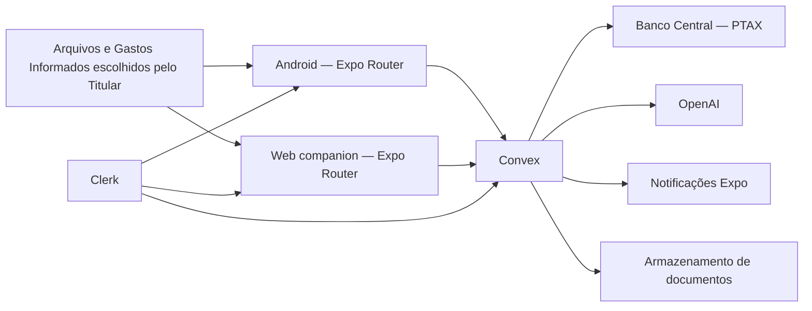
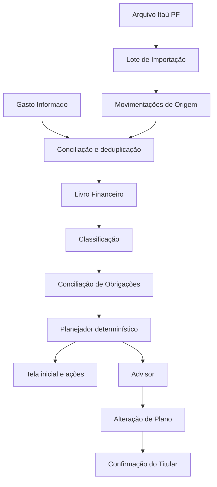
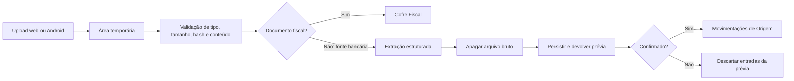

# Arquitetura

## 1. Direção

A arquitetura concentra regras complexas atrás de interfaces pequenas. A interface mobile e o companion web devem pedir resultados ao mesmo núcleo determinístico, sem reproduzir fórmulas em telas, jobs ou prompts.

O sistema começa como uma única aplicação universal Expo Router, com Convex como fonte de verdade em nuvem. Android é a experiência principal; a web começa com upload e cofre documental.

## 2. Topologia



## 3. Aplicação universal

- Expo Router fornece rotas Android e web no mesmo projeto.
- Rotas e elementos específicos usam extensões de plataforma somente quando o comportamento realmente divergir.
- A web inicial contém autenticação, upload e consulta do Cofre Fiscal.
- O Android contém consultas, revisões periódicas, biometria e notificações acionáveis.
- Um frontend web separado só será considerado se a experiência desktop exigir uma arquitetura própria.

Referências: [Expo Router](https://docs.expo.dev/router/introduction/), [publicação web com Expo](https://docs.expo.dev/guides/publishing-websites/) e [Clerk com Expo Web](https://clerk.com/docs/guides/development/web-support/overview).

## 4. Módulos

### 4.1 Acesso

**Interface**: responde se a sessão representa o Titular autorizado e se uma ação sensível possui autenticação recente.

Esconde sessões Clerk, allowlist, tokens, biometria e diferenças entre web e Android. Nenhum outro módulo decide autorização por conta própria.

A primeira prova usa uma seam de interface por plataforma: `AuthView` de `@clerk/expo/native` no Android e `SignIn` de `@clerk/expo/web` na web. O componente nativo beta executa o fluxo Google sem callback do Expo Router; o componente web administra o OAuth em popup. No Android, o cache oficial do Clerk persiste o token com `expo-secure-store`; a aplicação não persiste tokens manualmente.

Dentro do `ClerkProvider`, `ConvexProviderWithClerk` entrega o token ao Convex. O backend valida emissor e audiência antes de disponibilizar a identidade, e `requireAuthorizedOwner` compara o `subject` autenticado com a allowlist exclusiva do deployment. Depois da autorização, o helper entrega o `tokenIdentifier` qualificado pelo emissor como futuro `ownerId`; o Clerk User ID real não é persistido por esta prova. A consulta mínima `access.verifyOwner` não recebe identificador do cliente e não devolve identificadores; a aplicação só monta as telas internas depois dessa consulta. Ausência de identidade, allowlist ausente e identidade diferente falham fechadas. O retrato financeiro continua no adapter em memória e nenhum registro financeiro foi persistido nesta prova.

### 4.2 Registro do Ciclo Atual

**Interface**: recebe um Gasto Informado, calcula seu impacto provisório no plano e posteriormente o concilia com uma Movimentação de Origem.

Esconde entrada textual rápida, sugestões de data, categoria e meio de pagamento,
extração temporária de uma imagem escolhida pelo Titular e correspondência com a
importação posterior. Não acessa notificações de outros aplicativos e não
transforma um registro provisório em fato financeiro definitivo.

O diagnóstico Pluggy do spike anterior foi removido do aplicativo e do backend.
Ele não faz parte da arquitetura alvo do MVP, não deixou dados persistidos e não
alimentou o Livro Financeiro.

### 4.3 Pipeline de Importação

**Interface**: recebe um arquivo, produz uma prévia auditável e confirma ou descarta um Lote de Importação.

Esconde parsing, normalização, deduplicação, agrupamento, validação e descarte do
arquivo bruto. OFX/CSV e PDF do Itaú PF são adaptações internas da mesma
interface. A confirmação também procura correspondências com Gastos Informados
para impedir dupla contagem.

### 4.4 Livro Financeiro

**Interface**: recebe Movimentações de Origem confirmadas e devolve uma visão financeira canônica por conta, competência e Ciclo Financeiro.

Esconde transferências internas, estornos, câmbio, pagamentos de fatura, duplicatas entre fontes e conciliações. É a única fonte para saldos e compromissos usados pelo Planejador.

### 4.5 Classificação

**Interface**: classifica um conjunto de movimentações e explica a regra ou incerteza aplicada.

Esconde normalização de estabelecimentos, regras do Titular, recorrência e sugestões da IA. Uma sugestão nunca substitui uma Regra de Classificação confirmada.

### 4.6 Obrigações

**Interface**: materializa ocorrências de uma competência, concilia pagamentos e retorna exceções acionáveis.

Esconde recorrência, tolerância de valor e data, correspondência de movimentações, estados e lembretes.

### 4.7 Planejador

**Interface**: recebe um retrato financeiro versionado e retorna um Plano Financeiro determinístico com valores, justificativas e nível de confiança.

Esconde cálculo de disponibilidade, provisões, base essencial, reservas, prioridades e políticas trimestrais. Não faz I/O e deve ser o principal módulo testado por exemplos e propriedades.

### 4.8 Fiscal

**Interface**: calcula fatos fiscais suportados a partir de regras versionadas e valida documentos contra os resultados esperados.

Esconde PTAX, calendário de dias úteis, pró-labore, INSS, preparação de NFS-e e limites acompanhados. Regra provisória e regra confirmada usam versões distintas; histórico nunca é recalculado silenciosamente.

### 4.9 Cofre Fiscal

**Interface**: recebe um documento, extrai metadados, relaciona-o a uma obrigação e aplica a política de retenção adequada.

Esconde armazenamento, hash, duplicidade, extração, validação e geração de pacotes. Documentos bancários brutos não usam a política de retenção do Cofre Fiscal.

### 4.10 Advisor

**Interface**: recebe um retrato financeiro minimizado e retorna três cenários estruturados e Alterações de Plano propostas.

Esconde preparação de contexto, redação de dados, escolha Luna/Terra, chamada ao modelo, validação do resultado e memória conversacional. O Advisor consome cálculos; não os cria.

### 4.11 Notificações

**Interface**: recebe eventos acionáveis e aplica preferência, prioridade, deduplicação e janela de silêncio.

Esconde tokens, canais Android, entrega e deep links. O restante do sistema não envia notificações diretamente.

## 5. Seams e adapters

| Seam | Adapter de produção inicial | Adapter de teste ou alternativa | Critério de substituição |
|---|---|---|---|
| Importação financeira | arquivos do Itaú PF | fixtures sanitizadas e fake em memória | novo formato real ou nova fonte aprovada |
| Registro do ciclo atual | entrada textual explícita | entrada por imagem escolhida e fake em memória | atrito, qualidade de extração e segurança |
| Fonte de câmbio | API oficial do Banco Central | fixture histórica | indisponibilidade ou mudança de contrato |
| Modelo de IA | OpenAI Responses API | fake estruturado | custo, qualidade ou política de dados |
| Identidade | Clerk | sessão fake | mudança de custo ou expansão de usuários |
| Extração documental | parsers determinísticos | fixtures e OCR opcional | qualidade por tipo de documento |
| Notificação | Expo Notifications | coletor em memória | confiabilidade da entrega |

A seam existe porque há um adapter de produção e um adapter de teste ou fallback real. Interfaces hipotéticas sem variação concreta não devem ser criadas.

## 6. Fluxo de dados financeiro



## 7. Modelo de dados proposto

Os nomes finais serão definidos no schema, mas estes registros devem existir conceitualmente:

| Registro | Responsabilidade |
|---|---|
| Perfil do Titular | preferências, moeda, timezone e configuração de acesso |
| Conta financeira | identidade estável de conta, cartão ou reserva |
| Intenção de upload | proprietário, expiração e estado operacional do arquivo bancário temporário |
| Lote de importação | origem, hash, prévia, erros e confirmação |
| Movimentação de origem | registro imutável recebido ou importado |
| Gasto informado | registro provisório, impacto estimado e conciliação posterior |
| Lançamento financeiro | interpretação canônica, conciliação e transferências internas |
| Regra de classificação | padrão confirmado e vigência |
| Ciclo financeiro | datas, recebimento e estado de fechamento |
| Obrigação | modelo recorrente |
| Ocorrência de obrigação | compromisso de uma competência |
| Plano financeiro | entradas, regra, resultado e confiança |
| Alocação | valor destinado a provisão, consumo, margem ou reserva |
| Limite por categoria | teto confirmado, consumo conhecido e estimativa restante |
| Resumo empresarial | agregados mensais da Empresa necessários ao planejamento integrado |
| Reserva | meta, saldo reconhecido e marcos |
| Objetivo | meta principal ou secundária e prioridade |
| Regra fiscal | versão, vigência, fonte e estado de validação |
| Cotação | moeda, taxa, tipo, boletim, data e fonte |
| Documento fiscal | metadados, hash, localização e obrigação relacionada |
| Alteração de plano | antes, depois, impacto e decisão |
| Evento de auditoria | ator, ação, alvo, horário e resultado |

Todos os registros financeiros devem carregar `ownerId`, moeda, timezone relevante e origem. Valores monetários usam inteiros na menor unidade ou representação decimal exata; `number` de ponto flutuante não é aceito para cálculos financeiros.

## 8. Ingestão e consistência

- Cada Lote de Importação mantém competência, período coberto e instante de confirmação.
- Operações de ingestão são idempotentes.
- O hash do arquivo identifica reimportações: lotes confirmados são devolvidos sem novas Movimentações de Origem, enquanto lotes descartados ou rejeitados podem voltar ao estado de prévia.
- Uma prévia só é persistida depois que o objeto bruto correspondente foi apagado do Convex Storage.
- Movimentações de Origem são imutáveis; correções criam interpretações ou vínculos novos.
- Gastos Informados são provisórios e reconciliados sem duplicar a Movimentação de Origem correspondente.
- O Disponível para Gastar contém `asOf` e nível de confiança.
- O Limite de Gasto do Ciclo e seus Limites por Categoria preservam o plano mesmo sem dados atuais completos.
- Dados desatualizados bloqueiam linguagem de certeza; valores do ciclo atual permanecem identificados como estimativas.
- Fechamentos preservam o resultado usado na época, mesmo quando regras futuras mudarem.

## 9. Offline

O Android mantém cache criptografado do último retrato necessário à tela inicial. Em modo offline:

- consulta é permitida;
- Gastos Informados podem aguardar envio em armazenamento local protegido;
- ações financeiras não são confirmadas;
- a data do último fechamento e o estado provisório ficam evidentes;
- o valor não é apresentado como atualizado ou seguro;
- documentos aguardam conexão antes de upload.

## 10. Documentos



Upload não concede confiança ao conteúdo. Tamanho, hash, moeda, período, transações e parser compatível são verificados no backend. Intenções de upload bancário expiram em 15 minutos; uploads associados a uma intenção são limpos pelo processamento, pelo fallback explícito do cliente ou pela rotina server-side de expiração.

## 11. IA

- Usar Responses API com `store: false`.
- Manter memória e histórico no Convex, sob política própria.
- Remover CPF, CNPJ, números de conta, credenciais e texto bruto desnecessário.
- Enviar agregados e IDs opacos sempre que possível.
- Exigir saída estruturada para cenários e Alterações de Plano.
- Validar schema e referências antes de mostrar uma recomendação.
- Luna atende rotina e análise semanal; Terra atende fechamento ou decisão profunda.
- Toda recomendação registra modelo, versão de prompt, dados resumidos e decisão do Titular.

## 12. Interface e design system

- NativeWind é a base de estilo.
- NativeWind v4 estável é o ponto de partida; a compatibilidade é validada na primeira fatia de interface e a versão efetivamente usada fica fixada no lockfile.
- A primeira fatia validou NativeWind `4.2.6` com Tailwind CSS `3.4.19`, conforme a cadeia estável da v4; tokens semânticos vivem em `src/global.css` e o mapeamento de utilitários em `tailwind.config.js`.
- OKLCH é a fonte dos tokens web; Android e iOS recebem fallbacks sRGB derivados no build, pois `react-native-css-interop` `0.2.6` descarta `oklch()` como valor nativo. A compilação Android dos utilitários semânticos é verificada por `npm run check:styles`.
- A primeira fatia usa somente tema claro. Tema escuro será ativado apenas depois de validar tokens, contraste e superfícies como uma capacidade completa.
- React Native Reusables é a primeira fonte consultada antes de criar um primitivo genérico. A matriz em `docs/design/react-native-reusables-adoption-matrix.md` cruza o catálogo oficial com as telas planejadas.
- `Text`, `Button` e `Card` foram incorporados como código do projeto a partir do React Native Reusables e adaptados aos tokens, alvos de toque, estados de foco e motion do Brenotion.
- O catálogo não será instalado integralmente: cada componente entra somente quando um fluxo real demonstra a necessidade e suas dependências são justificadas.
- Código copiado é tratado como código próprio, com origem e data registradas, acessibilidade, testes e atualização manual deliberada.
- Valores financeiros usam numerais tabulares e formatação centralizada.
- Componentes do domínio são construídos sobre os primitivos, sem acoplar cálculos à apresentação.

Referências: [matriz de adoção](./design/react-native-reusables-adoption-matrix.md), [React Native Reusables](https://reactnativereusables.com/docs), [instalação manual](https://reactnativereusables.com/docs/installation/manual) e [NativeWind](https://www.nativewind.dev/docs/getting-started/installation).

## 13. Estrutura inicial proposta

```text
src/
  app/                     rotas Expo Router
  modules/
    access/
    advisor/
    classification/
    documents/
    financial-integration/
    fiscal/
    ledger/
    obligations/
    planning/
  ui/
    primitives/
    financial/
convex/
  schema.ts
  functions/
  adapters/
docs/
  adr/
```

Cada módulo expõe uma interface pequena. Funções Convex e rotas Expo são callers; não contêm regra financeira duplicada.

## 14. Estratégia de testes

- Planejador e Fiscal: exemplos, tabelas de decisão, propriedades e regressões históricas.
- Livro Financeiro: fixtures de estorno, pagamento de fatura, transferência interna, câmbio e duplicata.
- Importação: golden files sanitizados para cada formato.
- Integrações externas: testes de contrato e adapters fake.
- Obrigações: relógio controlado e cenários de tolerância.
- Advisor: validação de schema e invariantes, sem snapshots frágeis de texto.
- Interface: testes de comportamento nos fluxos críticos; smoke tests Android e web.
- Segurança: autorização negativa em cada função pública e teste de ciclo de vida dos arquivos.

Os testes atravessam a mesma interface usada pelos callers. Refatorações internas não devem exigir reescrever testes de comportamento.

## 15. Entrega

- Android por EAS Internal Distribution.
- Web por hosting com HTTPS e cabeçalhos de segurança.
- Ambientes separados para desenvolvimento e produção.
- O repositório GitHub é público e contém somente código, documentação e dados sintéticos; CI e revisão por PR permanecem obrigatórios para mudanças relevantes.
