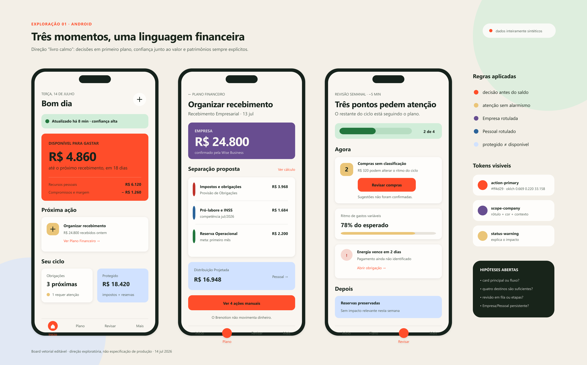
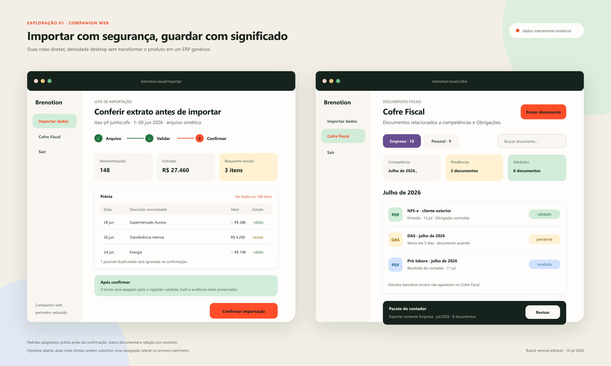

# Exploração visual e design system

Esta pasta registra a exploração visual anterior ao desenvolvimento da interface do Brenotion. O objetivo é reduzir decisões arbitrárias no scaffold sem transformar os primeiros mockups em uma especificação rígida.

## Estado

Os artefatos atuais são **candidatos para discussão**. Uma decisão só se torna parte do design system quando aparece como token ou regra aprovada neste diretório. Imagens exploratórias continuam descartáveis.

Direção confirmada pelo Titular em 14 de julho de 2026: começar próximo aos defaults do ecossistema shadcn/React Native Reusables, usar `#ff4d29` como accent inicial, limitar raios de componentes a `8–12 px` e evoluir o craft principalmente por hierarquia, microinterações, motion e refinamento progressivo de cor.

## Artefatos

- [Inventário de telas](./screen-inventory.md): jornadas, superfícies, prioridades e estados obrigatórios.
- [Board de inspirações](./inspiration-board.md): referências do Mobbin, intenção de uso e limites de adaptação.
- [Fundamentos do design system](./design-system-foundations.md): princípios, tokens candidatos e componentes de domínio.
- [Guia de feedback visual](./feedback-guide.md): formato recomendado para criticar estrutura, polish, cor e motion.
- [Direções de laranja](./color-directions.md): famílias candidatas, tons e regras de contraste.
- [Catálogo de candidatos por tela](./screen-candidate-catalog.md): cobertura visual, links Mobbin e acesso ao protótipo comparativo.
- [Protótipo comparativo](./prototypes/prototype-screen-catalog.html): três candidatos estruturais por superfície, alternáveis por URL e lado a lado.
- Board Android — jornadas principais: [imagem estática](./boards/core-journeys.png) e [fonte vetorial editável](./boards/core-journeys.svg).
- Board web — importação e Cofre Fiscal: [imagem estática](./boards/companion-web.png) e [fonte vetorial editável](./boards/companion-web.svg).

## Boards atuais

## Método de exploração

1. Partir de uma jornada ou decisão concreta, nunca de uma tendência visual isolada.
2. Buscar referências por problema de interface e registrar o que será adaptado.
3. Produzir conceitos com dados inteiramente sintéticos.
4. Comparar a proposta com os invariantes de produto e os estados de confiança.
5. Promover apenas decisões reutilizáveis para tokens e componentes.
6. Manter alternativas rejeitadas ou adiadas no histórico quando a justificativa tiver valor futuro.

## Regras para evolução

- O board não é uma biblioteca de telas a copiar. Ele é evidência para uma decisão.
- Uma nova direção pode coexistir com a atual enquanto a hipótese estiver aberta.
- Empresa e Pessoal, disponível e protegido, recente e desatualizado nunca dependem somente de cor.
- Primitivos de interface continuam sob responsabilidade do React Native Reusables ou equivalente aprovado no spike. Este design system define tokens, composição e componentes do domínio.
- Mudanças em termos visíveis devem respeitar [`CONTEXT.md`](../../CONTEXT.md).
- Mockups não usam dados financeiros reais, ainda que anonimizados superficialmente.

## Próximas explorações

1. Validar a hierarquia da tela inicial em dados recentes, parciais e desatualizados.
2. Explorar duas alternativas para a revisão em lote do onboarding histórico.
3. Explorar a comparação antes/depois de uma Alteração de Plano.
4. Testar tema escuro sem transformar estados financeiros em brilho decorativo.
5. Converter os tokens aprovados em uma configuração experimental do NativeWind durante o spike universal.
6. Prototipar motion em código; imagens estáticas não aprovam timing, easing ou interruptibilidade.
