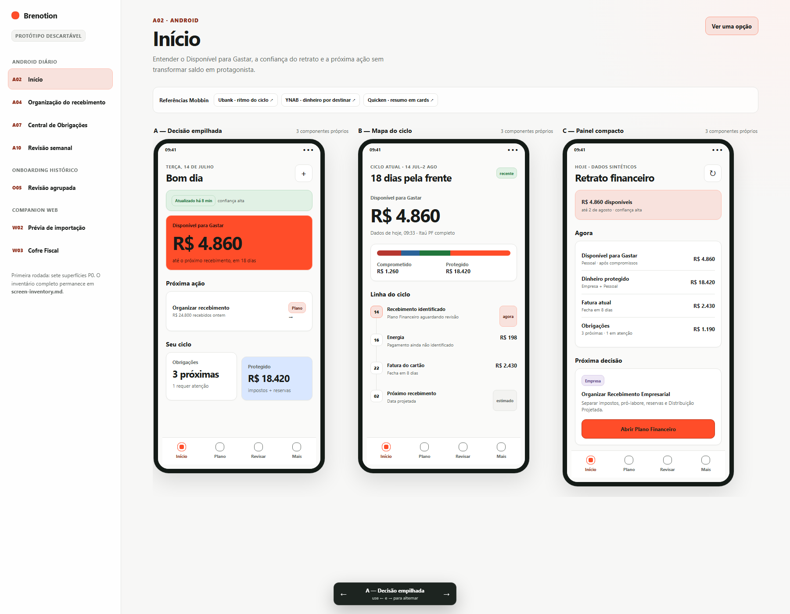

# Protótipo — catálogo de candidatos por tela

**Pergunta:** quais estruturas visuais podem servir a cada superfície principal do Brenotion antes do scaffold?

Este código é descartável. Ele usa HTML, CSS e JavaScript sem dependências para aproximar tokens e composições do que poderá ser implementado depois com NativeWind, React Native Reusables e componentes próprios.

## Abrir

No PowerShell, a partir do repositório:

```powershell
./docs/design/prototypes/open-screen-catalog.ps1
```

Também é possível abrir diretamente [`prototype-screen-catalog.html`](./prototype-screen-catalog.html).

## Navegação

- selecione uma tela na lateral;
- use `A`, `B` e `C` no switcher inferior;
- use as setas esquerda e direita do teclado para trocar a variação;
- ative **Comparar lado a lado** para ver as três opções;
- a URL preserva `screen`, `variant` e o modo de comparação.

## Escopo desta rodada

- A02 — Início;
- A04 — Organização do recebimento;
- A07 — Central de Obrigações;
- A10 — Revisão semanal;
- O05 — Revisão agrupada;
- W02 — Prévia de importação;
- W03 — Cofre Fiscal.

Nenhuma ação persiste dados. Todos os valores e nomes são sintéticos.

## Prévia


